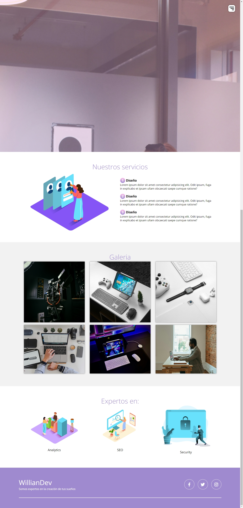
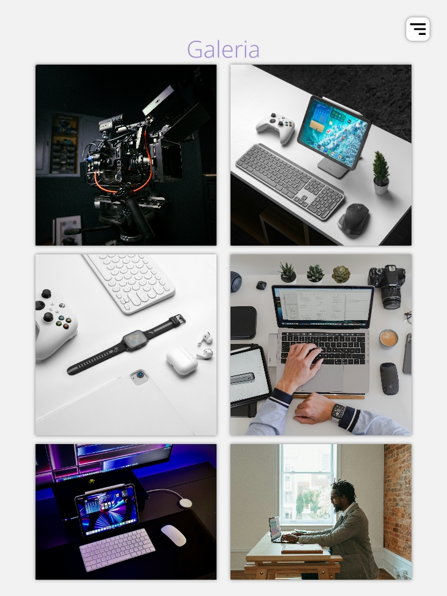
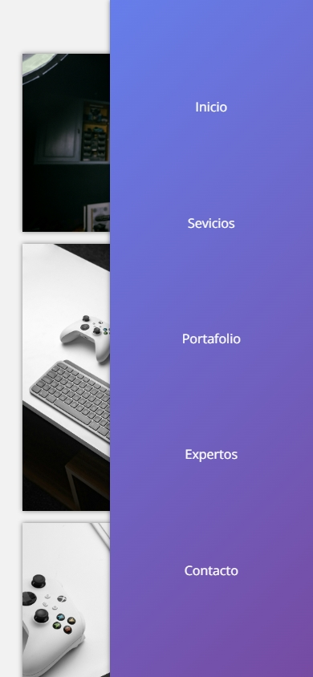

# Spanish - DO

# Proyecto Landing Page - Inicio 🚀 

  ¡Bienvenido al Proyecto Landing Page! 🌟 

  Este proyecto está en sus primeras etapas de desarrollo y se trata de una simple Landing Page. Estamos emocionados por empezar y compartimos algunas características básicas y la estructura inicial de la página.

## Contenido

1. **Acerca de** ℹ️

  - Este proyecto tiene como objetivo proporcionar a los visitantes una introducción clara y atractiva a nuestro producto/servicio. A través de un diseño moderno y funcionalidades intuitivas, buscamos destacar los aspectos más relevantes de nuestra oferta, incentivando la participación y exploración por parte de los usuarios. Esta página servirá como punto de entrada principal para aquellos que buscan información sobre lo que ofrecemos, con futuras actualizaciones planeadas para incorporar aún más características y mejorar la experiencia del usuario 😊.

  Agradezco sinceramente cualquier retroalimentación o sugerencia constructiva que deseen compartir. Su opinión es invaluable para nosotros y contribuirá al continuo mejoramiento y perfeccionamiento de nuestro proyecto. Estamos ansiosos de escuchar sus comentarios. 🌟 

  Permaneceremos en constante evolución y actualización. 🚀 

# English - us

  Welcome to the Landing Page Project! 🌟 

  This project is in its early development stages and revolves around a simple Landing Page. We are excited to kick off and share some basic features and the initial structure of the page.

  Content
  About ℹ️

  The goal of this project is to provide visitors with a clear and engaging introduction to our product/service. Through a modern design and intuitive functionalities, we aim to highlight the most relevant aspects of our offering, encouraging user participation and exploration. This page will serve as the main entry point for those seeking information about what we provide, with future updates planned to incorporate even more features and enhance the user experience 😊.

  I sincerely appreciate any feedback or constructive suggestions you may wish to share. Your opinion is invaluable to us and will contribute to the continuous improvement and refinement of our project. We are eager to hear your comments. 🌟 

  We will remain in constant evolution and update. 🚀 
2. **Capturas de Pantalla** 📷 

- 

 - 

### Tablet 📷 

 - 

### Phone 📷 

 - 

## Instrucciones de Uso 📋 

Les mantendremos informados durante cada fase de evolución. 📈 Permanezcan atentos para recibir las últimas actualizaciones

1. **Clonación del Repositorio:**
  ```bash
  git clone https://github.com/Willianwt2000/Landing-page.git
  ```
